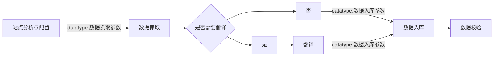
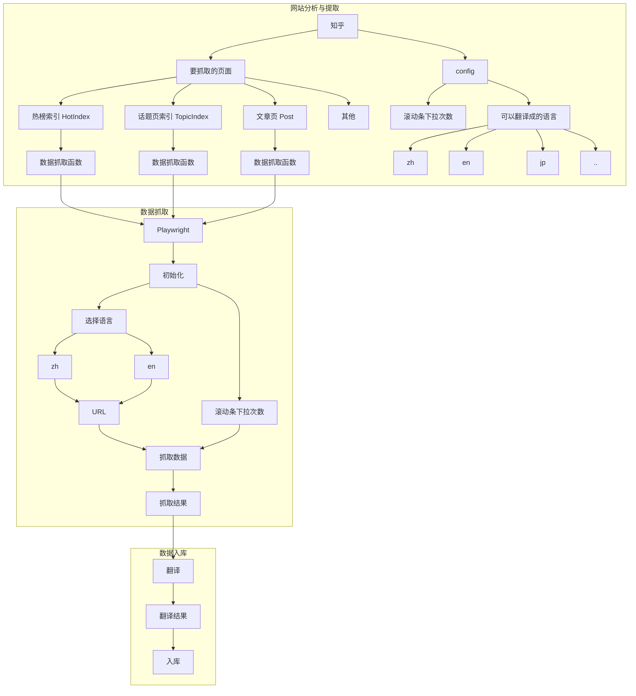

# 数据收藏家

## 需要考虑的问题
1. 模块
    - [ ] [数据抓取模块](文档/数据抓取.md)
    - [翻译模块](文档/翻译模块.md)
    - [对象存储模块]
2. 语言问题
同时抓取多语言速度太慢，因此默认只抓取一种语言。如果要补全其他语言，需要另外一套程序
## 收藏步骤



## 数据抓取详细流程


### 使用
```bash
npx playwright test
npx playwright test --headed --debug
npx playwright show-trace trace.zip
npx playwright codegen https://www.zhihu.com/signin --save-storage=tests/知乎/auth.json --timeout=99999999
npx playwright codegen https://www.quora.com --save-storage=数据抓取/社会/quora/auth.json --timeout=99999999
npx playwright show-report
npx playwright codegen --save-storage=auth.json
npx playwright open --load-storage=auth.json my.web.app
npx playwright codegen --load-storage=auth.json my.web.app
npx playwright test --workers=5
```
